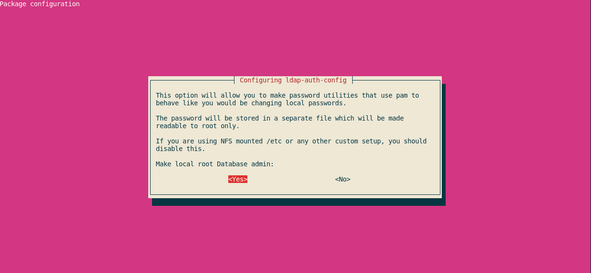

# [ ASO ] Instalación y configuración inicial de OpenLDAP

## Realiza la instalación y configuración básica de OpenLDAP en thor,utilizando como base el nombre DNS asignado. Deberás crear un usuario llamado prueba y configurar una máquina cliente basada en Debian y Rocky para que pueda validarse en servidor ldap configurado anteriormente con el usuario prueba.

Realizada por Jose Carlos Rodríguez Cañas.

### Instalación de OpenLDAP

Primero de todo, tendremos que ver si esta bien configurado el FQDN de odin:


Seguido de esto, deberemos instalar OpenLDAP en thor, es por ello que ejecutaremos los siguientes comandos:

```sql
sudo apt update
sudo apt install slapd
```

Durante la instalación, nos pedirá que la contraseña para acceder al directorio de LDAP.


Cuando tengamos la contraseña puesta, la instalación proseguirá de manera correcta. Tras esto, comprobamos que LDAP esta funcionando mediante la observación del puerto 389 (que es el puerto donde escucha las peticiones). Lo veremos con el siguiente comando:

```sql
sudo netstat -tlnp | egrep slap
```


Posteriormente, vamos a intalar el paquete que contiene las herramientas con las que vamos a trabajar que es el siguiente:

```sql
sudo apt install ldap-utils
```

Cuando tengamso este paquete instalado, vamos a realizar una prueba con el comando **ldapsearch** introduciendo las credenciales que introducimos en el proceso de instalación (Para realizar la búsqueda como administrador) para buscar el contenido que tenemos en nuestro directorio.

```sql
sudo ldapsearch -x -D "cn=admin,dc=peperc,dc=gonzalonazareno,dc=org" -b "dc=peperc,dc=gonzalonazareno,dc=org" -W
```


El comando **ldapsearch** se utiliza para conectarse a un servidor LDAP, autenticarse, y realizar búsquedas utilizando parámetros específicos. Aquí está una explicación breve de los parámetros mencionados:

- `x` : Indica que se utilizará autenticación simple en lugar de SASL.

- `D` : Especifica el enlace del DN (nombre distinguido), es decir, el nombre de usuario utilizado para autenticarse en el servidor LDAP.

- `b` : Especifica el DN base para la búsqueda, es decir, la ubicación dentro del árbol LDAP donde comenzará la búsqueda.

- `W` : Indica que se solicitará la contraseña del usuario durante la ejecución del comando.

En resumen, el comando **ldapsearch** abre una conexión al servidor LDAP, se autentica utilizando autenticación simple, y realiza una búsqueda utilizando los parámetros proporcionados. Si no se proporciona un filtro específico, se utiliza el filtro predeterminado (objectClass=*).

### Creación y configuración de Unidades Organizativas(UO), grupos y usuarios

Configuración de Unidades Organizativas (UO), grupos y usuarios se puede realizar mediante un único archivo con extensión .ldif o varios archivos .ldif separados.

El formato **LDIF** (LDAP Data Interchange Format) es estándar para configuraciones de LDAP. Es un archivo de texto plano donde se agregan, modifican o eliminan registros que se cargarán mediante un comando.

Para ver su funcionamiento, crearemos dos objetos tipo "Unidad Organizativa" utilizando un archivo .ldif con la siguiente estructura:

```sql
nano unidades-organizativas.ldif

dn: ou=Usuarios,dc=peperc,dc=gonzalonazareno,dc=org
objectClass: top
objectClass: organizationalUnit
ou: Usuarios

dn: ou=Grupos,dc=peperc,dc=gonzalonazareno,dc=org
objectClass: top
objectClass: organizationalUnit
ou: Grupos
```

Como podemos observar, he definido 2 Unidades Organizativas, que son *Usuarios* y *Grupos*. Para cargar la configuración de este fichero usamos el siguiente comando:

```sql
sudo ldapadd -x -D "cn=admin,dc=peperc,dc=gonzalonazareno,dc=org" -f unidades-organizativas.ldif -W
```


Si quisieramos borrar las unidades organizativas que acabamos de añadir, usamos:

```sql
sudo ldapdelete -x -D 'cn=admin,dc=peperc,dc=gonzalonazareno,dc=org' -W ou=Usuarios,dc=peperc,dc=gonzalonazareno,dc=org
sudo ldapdelete -x -D 'cn=admin,dc=peperc,dc=gonzalonazareno,dc=org' -W ou=Grupos,dc=peperc,dc=gonzalonazareno,dc=org
```

Tras esto,vamos a crear un grupo llamado pepegrupo, y lo añadiremos a la unidad organizartiva Grupos:

```sql
nano grupos.ldif

dn: cn=pepegrupo,ou=Grupos,dc=peperc,dc=gonzalonazareno,dc=org
objectClass: top
objectClass: posixGroup
gidNumber: 2001
cn: pepegrupo
```

Cuando ya tengamos el fichero creado, cargamos la configuración con este comando:

```sql
sudo ldapadd -x -D 'cn=admin,dc=peperc,dc=gonzalonazareno,dc=org' -W -f grupos.ldif
```


Si queremos borrarlo, usamos el comando:

```sql
sudo ldapdelete -x -D 'cn=admin,dc=peperc,dc=gonzalonazareno,dc=org' -W cn=pepegrupo,ou=Grupos,dc=peperc,dc=gonzalonazareno,dc=org
```

Con esto dicho, crearemos una contraseña cifrada para un usuario que crearemos posteriormente. Para cifrar la contraseña haremos uso del comando slappasswd:

```sql
sudo slappasswd
```


Tras esto, pasaremos a copiar la contraseña obtenida en el campo userPassword, a la hora de crear el usuario. Pasamos a la definición del usuario (en este caso se llamará user) crearemos el fichero usuarios.ldif y copiaremos el siguiente contenido:

```sql
nano usuarios.ldif

dn: uid=user,ou=Usuarios,dc=peperc,dc=gonzalonazareno,dc=org
objectClass: top
objectClass: posixAccount
objectClass: inetOrgPerson
objectClass: person
cn: user
uid: user
uidNumber: 2001
gidNumber: 2001
homeDirectory: /home/user
loginShell: /bin/bash
userPassword: {SSHA}uE6hDN0um0DiybYwYM8lGLko9EMSWert
sn: user
mail: user@gmail.com
givenName: user
```

Y cargamos al configuración con este comando:

```sql
sudo ldapadd -x -D 'cn=admin,dc=peperc,dc=gonzalonazareno,dc=org' -W -f usuarios.ldif
```


Para comprobar que se haya añadido corrctamente, ejecutamos este comando:

```sql
sudo ldapsearch -x -b dc=peperc,dc=gonzalonazareno,dc=org
```


Si queremos eliminar el usuario, ejecutaremos este comando:

```sql
sudo ldapdelete -x -D 'cn=admin,dc=peperc,dc=gonzalonazareno,dc=org' -W uid=user,ou=Usuarios,dc=pepe,dc=gonzalonazareno,dc=org
```

### Configuración NFS en el servidor

En un principio el usuario no tendrá acceso a su cuenta, ya que hemos definido que su directorio home será /home/user pero este no existe. Por lo que vamos a crearlo, además le aplicaremos como propietario y grupo el uid y gid que hemos definido anteriormente (al usuario user):

```sql
sudo mkdir /home/user
sudo chown 2001:2001 /home/user
```

Cuando tengamos la carpeta, pasamos a configurar el servidor NFS, para exportar el directorio /home del usuario user. Para ello editamos el fichero /etc/exports y añadimos la siguiente línea:

```sql
sudo nano /etc/exports
/home/user *(rw,fsid=0,subtree_check)
```

Cuando lo tengamos, reiniciamos el servicio NFS con este comando:

```sql
sudo systemctl restart nfs-server.service
```

Con esto haremos que el directorio /home/user se accesible desde el cliente y para ver que las exportaciones se han hecho de forma correcta, ejecutamos este comando:

```sql
sudo exportfs -v
```


### Instalación de Name Service Switch (NSS), Pluggable Authentication Module (PAM) y Name Service Cache Daemon (NSCD) en el servidor

En el servidor LDAP, debemos instalar varios paquetes que nos permitirán resolver nombres de usuarios (UID), grupos (GID), identificación, consultar información de directorios y almacenar resoluciones de nombres en caché. Instalaremos los paquetes necesarios usando el siguiente comando:

```sql
sudo apt install libpam-ldapd nscd libnss-ldap
```

Cuando lo inslalemos, nos pedirá que pongamos nuestra propia máquina a la hora de configurar el paquete nslcd de la siguiente manera:





Nota: Si queremos restablecer esta configuración, usamos:

```sql
sudo dpkg-reconfigure libnss-ldap
```

Comprobamos el uuid del usuario user:

```sql
sudo id user
```

Finalmente, probaremos a loguearnos con el usuario user, y la contraseña que establecimos anteriormente "Cifrada".

```sql
sudo login user
```


### Configuración del cliente Ubuntu Loki

Lo primero que haremos será instalar el paquete que contiene las herramientas de ldap:

```sql
sudo apt install ldap-utils
```

Lo siguiente que vamos a hacer será, modificar el fichero de configuración para el cliente, añadiendo las dos siguientes líneas:

```sql
sudo nano /etc/ldap/ldap.conf

BASE dc=peperc,dc=gonzalonazareno,dc=org
URI ldap://odin.peperc.gonzalonazareno.org
```

Cuando terminemos de modificar el fichero de configuración, comprobaremos que se hayan aplicado los cambios, con el comando:

```sql
sudo ldapsearch -x -b "dc=peperc,dc=gonzalonazareno,dc=org"
```


Para verificar que podamos autenticarnos, ejecutamos el siguiente comando (Posteriormente introducimos la contraseña del usuario user):

```sql
sudo ldapwhoami -x -D "uid=user,ou=Usuarios,dc=peperc,dc=gonzalonazareno,dc=org" -W
```


Como hicimos anteriormente en el servidor, instalaremos los paquetes libnss-ldap, libpam-ldapd y nscd:

```sql
sudo apt install libnss-ldap libpam-ldapd nscd -y
```

Indicamos la configuración como hicimos anteriormente en el servidor:


Una vez configurado, reinciamos la máquina (En este caso el contenedor LXC) o el servicio nscd.

```sql
sudo systemctl restart nscd
```

Con esto ya podremos logearnos desde el cliente, con el usuario user, pero no podremos acceder a su directorio personal. Para ello vamos a crear una unidad systemd, con la cual montaremos el directorio mediante NFS.

Por lo que antes que nada crearemos el directorio donde montaremos el home del usuario user y le aplicamos el propietario:

```sql
sudo mkdir /home/user
sudo chown 2001:2001 /home/user
```

Instalaremos el paquete que contiene el cliente NFS:

```sql
sudo apt install nfs-common -y
```

Iniciamos y habilitamos el servicio:

```sql
sudo systemctl start nfs-client.target 
sudo systemctl enable nfs-client.target
```

Creamos la unidad nfs:

```sql
sudo nano /etc/systemd/system/home-user.mount
```

Y añadimos el siguiente contenido:

```sql
[Unit]
Description=Montaje NFS (/home/user)
Requires=network-online.target
After=network-online.target
[Mount]
What=192.168.0.2:/home/user
Where=/home/user
Options=_netdev,auto
Type=nfs
[Install]
WantedBy=multi-user.target
```

Recargamos el demonio systemd para que reconozca el nuevo fichero con extensión .mount:

```sql
sudo systemctl daemon-reload
```

Iniciamos y habilitamos la unidad:

```sql
sudo systemctl start home-user.mount
sudo systemctl enable home-user.mount
```

Comprobamos el estado con:

```sql
sudo systemctl status home-user.mount
```

Ahora probaremos a loguearnos con el usuario user (Desde el cliente ubuntu):


Y con esto ya hemos terminado la práctica de la instalación y configuración básica de OpenLDAP en Thor.